# Car Viewing Application

A desktop application for browsing, searching, filtering, and comparing car listings and automotive news sourced live from [AutoDeal.com.ph](https://www.autodeal.com.ph). Built with Python and PySide6.

---

## Overview

Car Viewer scrapes the latest car listings and news articles from AutoDeal.com.ph on every launch, stores the data locally in a SQLite database, and presents it through a clean, modern desktop interface. Users can browse new and used cars, filter by brand and condition, compare two cars side by side, and read the latest automotive news through the app.

---

## Features

- Live scraping of new and used car listings from AutoDeal.com.ph on every launch
- Browse car listings in a grid view with images, prices, and details
- Filter cars by brand and condition (New / Used / Both)
- Search cars and news articles by keyword
- Side-by-side car comparison with detailed specification breakdown
- Automotive news feed sourced from AutoDeal.com.ph, sorted by most recent
- Currency conversion between PHP, USD, and CNY
- Home page with a featured car slideshow and latest news highlights
- Local SQLite database with a raw table view in the Database page
- Animated navigation with sliding menus and page transitions

---

## Prerequisites

Before setting up the application, make sure you have the following installed:

- Python 3.10 or higher
- Mozilla Firefox (required by Selenium for web scraping, geckodriver is managed automatically)
- Git

---

## Installation and Setup

### 1. Clone the repository

```bash
git clone https://github.com/AndreGiancarloLu/Car-Viewing-Application.git
cd Car-Viewing-Application
```

### 2. Create and activate a virtual environment

```bash
python -m venv env
```

On Windows:
```bash
.\env\Scripts\activate
```

On macOS / Linux:
```bash
source env/bin/activate
```

### 3. Install dependencies

```bash
pip install -r requirements.txt
```

### 4. Run the application

```bash
python main.py
```

On first launch, the app will scrape car listings and news from AutoDeal.com.ph and populate the local database. This initial scrape may take several minutes depending on your internet connection. Subsequent launches will be faster as the database already exists and only needs to be updated.

---

## Page Walkthrough

### Home

The home page displays a full-width featured car slideshow that auto-advances every 5 seconds, with previous and next controls. Below the slideshow is a row of the 5 most recent news articles as cards. Clicking any car or news card navigates to its detail page.

The image below shows the Home page:
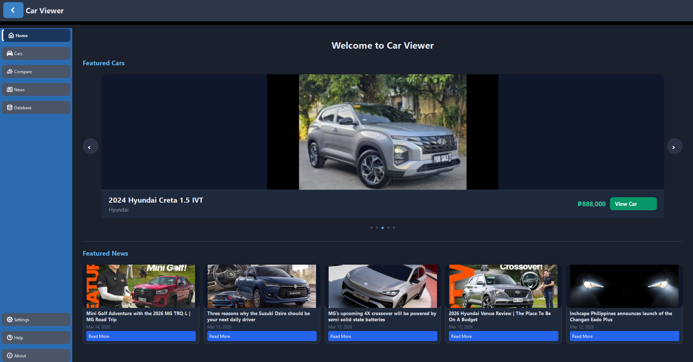

### Cars

The cars page displays all scraped car listings in a grid. Each card shows the car image, name, and price. The search bar at the top allows keyword search, and the filter bar below it allows filtering by condition (New, Used, or Both) and by brand. Clicking "View Details" on any card opens the car's detail page with full specifications.

The image below shows the default Cars page:
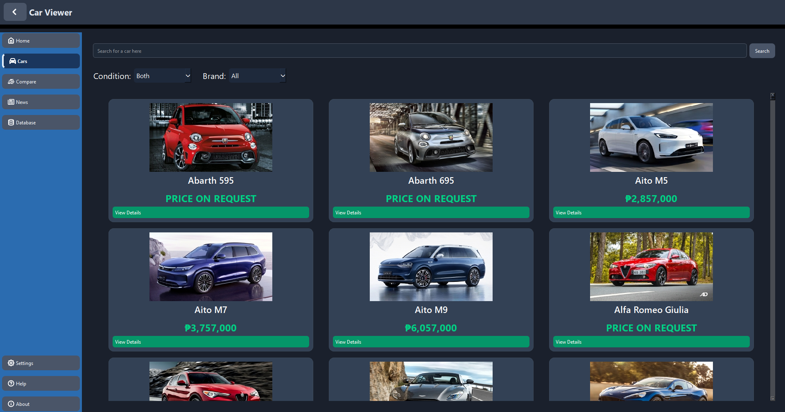

The image below shows the page after you click the "View Details" button on a particular car:
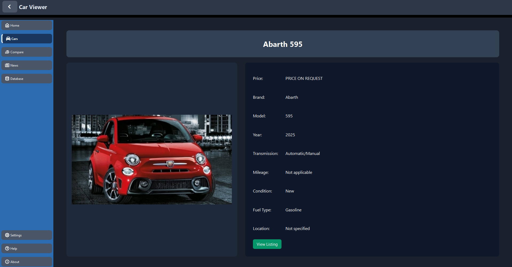

### Compare

The compare page has two side-by-side panels, each with its own search bar and filter bar. Select one car from each panel to trigger a detailed comparison table below, which highlights differences in price, specifications, performance, dimensions, safety features, and comfort features. Use "Reset Comparison" to clear both selections.

The image below shows the default Compare page:
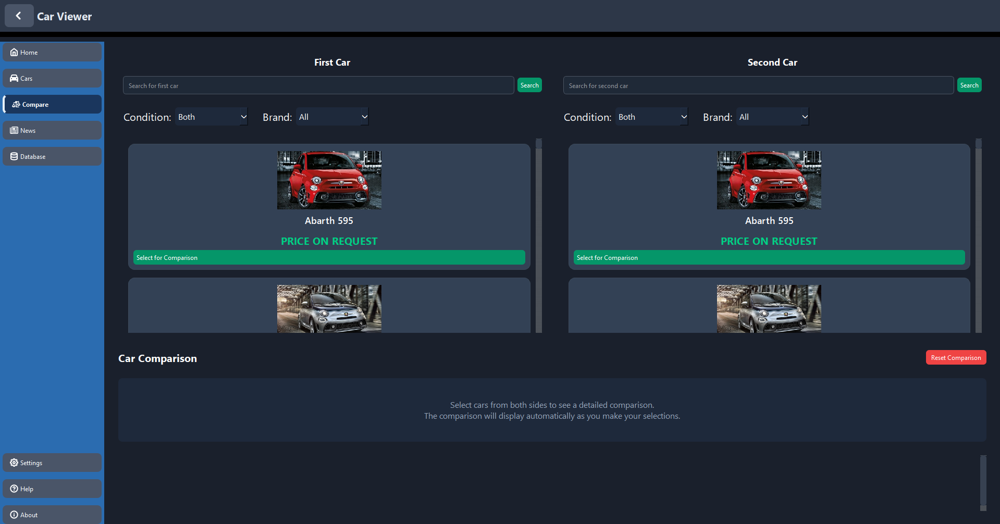

The image below shows the page after selecting two cars for comparison:
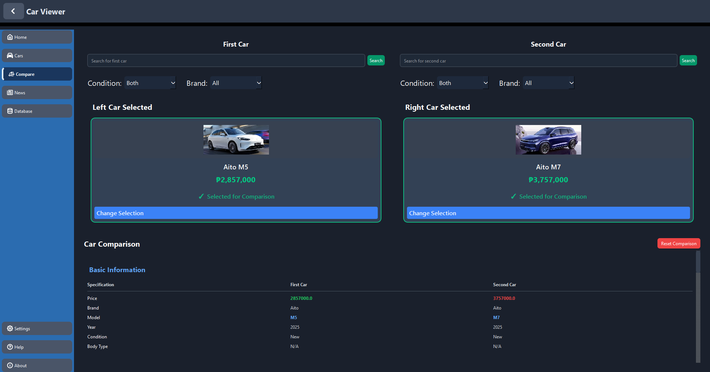

### News

The news page displays automotive news articles sourced from AutoDeal.com.ph, sorted by most recent. Each card shows the article image, title, and date. Use the search bar to filter articles by keyword. Clicking "Read More" opens the full article view.

The image below shows the default News page:
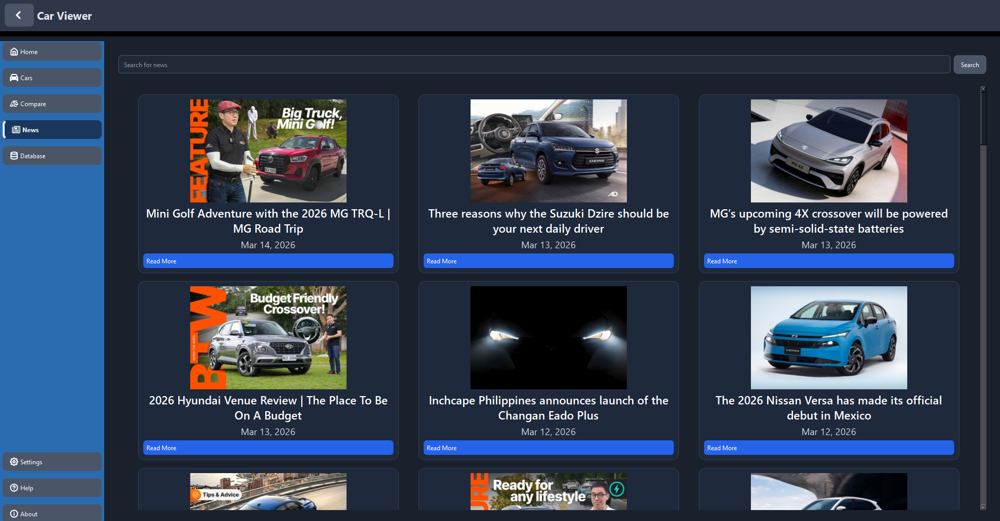

The image below shows the page after you click the "View Details" button on a specific news article:
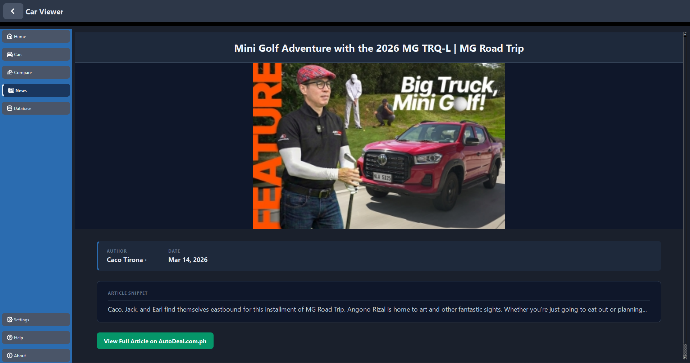

### Database

The database page shows a raw table view of all car records currently stored in the local SQLite database. Columns can be sorted by clicking the headers.

New car listings can be added directly from this page by clicking the **Add Car** button in the top-right corner, which opens a side panel. Paste an AutoDeal listing URL into the input field and click **Add Car** to scrape and save the listing to the database. The table and cars page update automatically once the listing is added.

The image below shows the Database page:
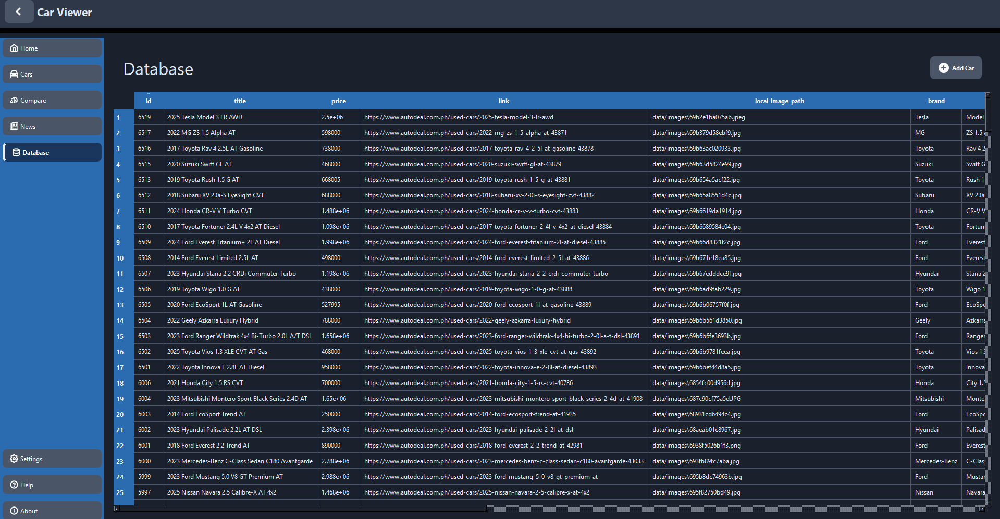

The image below shows the Database page after clicking the "Add Car" button:
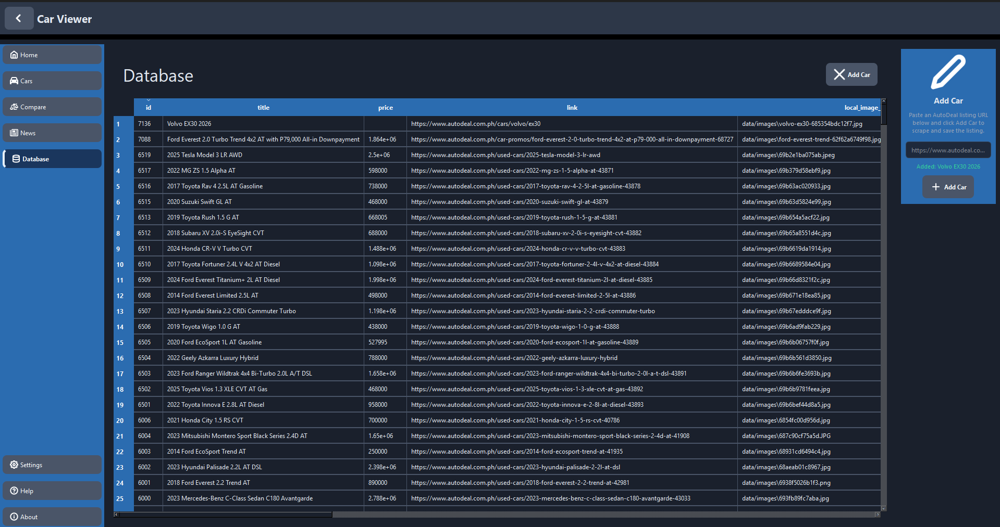

### Settings

The settings page allows you to change the display currency. Supported currencies are PHP (Philippine Peso), USD (US Dollar), and CNY (Chinese Yuan). Prices across the entire app update immediately when the currency is changed. Note that conversion rates are approximate and fixed. They are not fetched live.

The image below shows the Settings page with the dropdown for selecting currency:
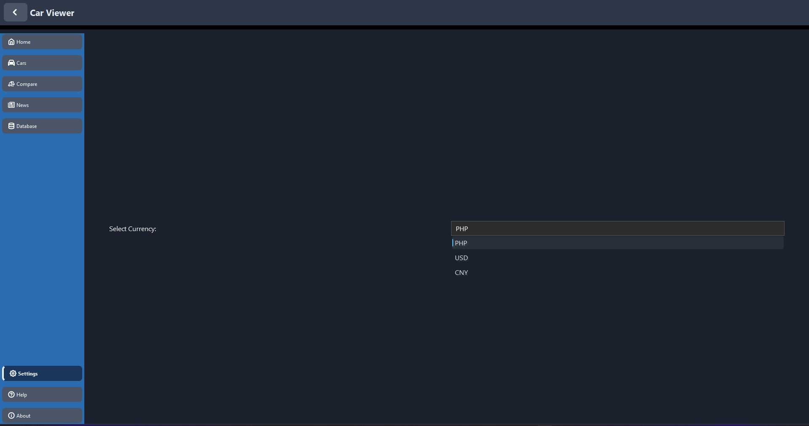

### Help

The help page contains a collapsible FAQ accordion covering common questions about using the app, including how to search, filter, compare cars, and understand the data source.

The image below shows the Help page:
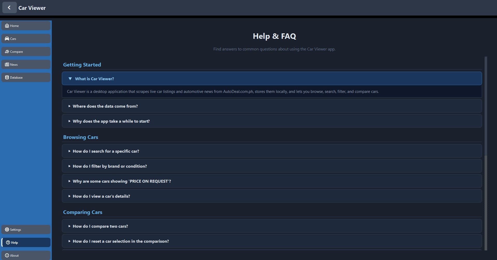

### About

The about page contains information about the application, the developer, the tech stack, and the data source.

The image below shwos the About page:
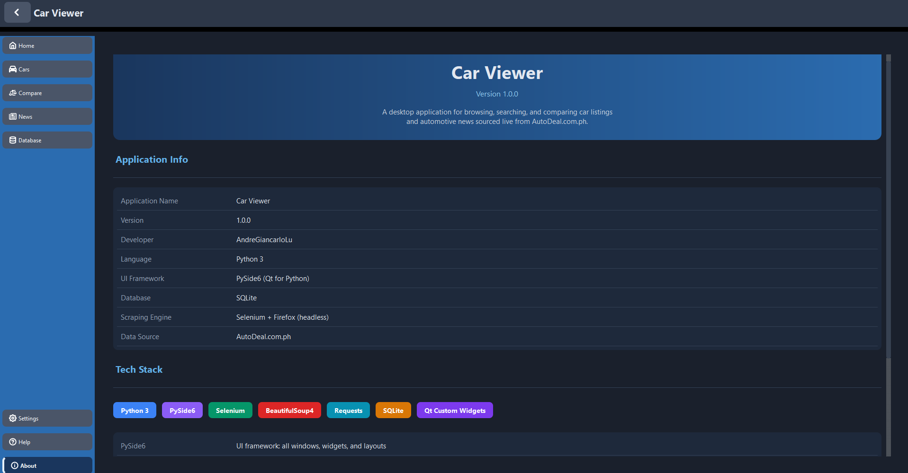

---

## Data Source and Attribution

All car listings and news articles displayed in this application are sourced from **AutoDeal.com.ph**, one of the Philippines' leading automotive marketplaces. Data is retrieved through web scraping using a headless Firefox browser via Selenium and is stored locally on the user's machine.

This application is intended for personal and educational use only. All data, content, and intellectual property belong to AutoDeal.com.ph. This project is not affiliated with, endorsed by, or officially connected to AutoDeal in any way.

---

## Known Limitations

- Car listings and news articles reflect AutoDeal.com.ph at the time of each scrape and may not match current real-world availability or pricing.
- Currency conversion rates are fixed approximations and are not fetched from a live exchange rate source.
- The data source is specific to the Philippine automotive market.
- The first launch requires an active internet connection and takes several minutes to complete the initial scrape.
- Some car listings may show "PRICE ON REQUEST" where no price was listed in the original source.

---

## Tech Stack

| Technology | Purpose |
|---|---|
| Python 3 | Core language |
| PySide6 | Desktop UI framework |
| Selenium | Headless Firefox browser for web scraping |
| BeautifulSoup4 | HTML parsing for car detail pages |
| Requests | HTTP client for downloading images |
| SQLite | Local database for storing scraped data |
| QT-PyQt-PySide-Custom-Widgets | Sliding menus and animated navigation by KhamisiKibet |

---

## Developer

**AndreGiancarloLu**  
Repository: [https://github.com/AndreGiancarloLu/Car-Viewing-Application](https://github.com/AndreGiancarloLu/Car-Viewing-Application)
